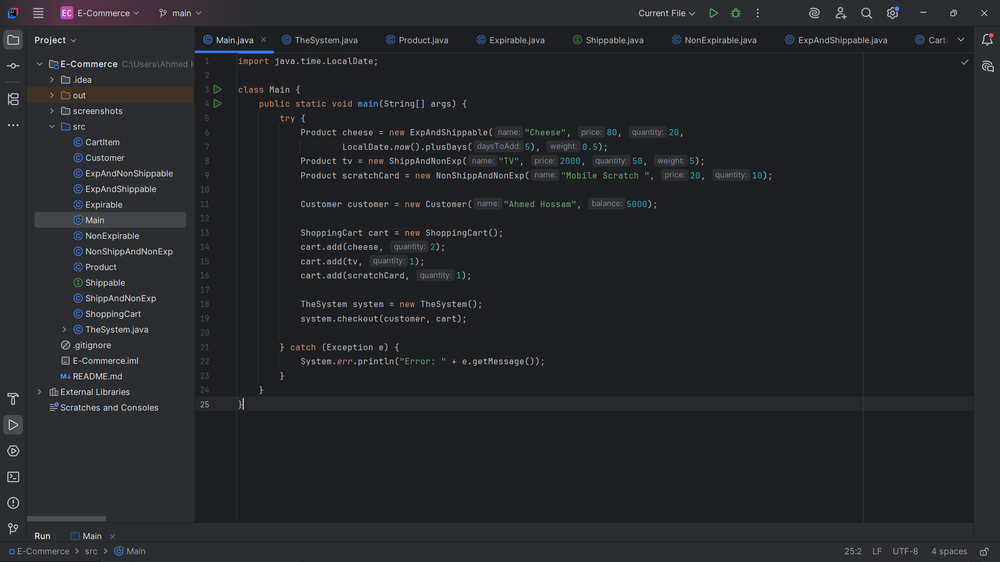
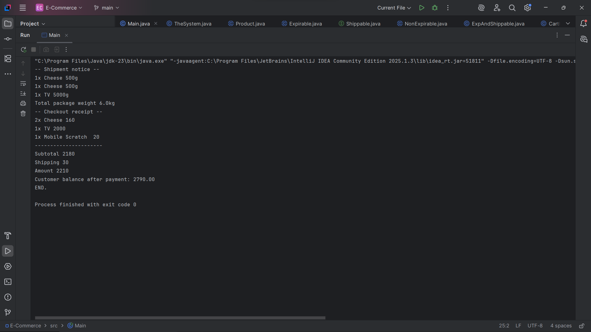

# E-Commerce Shopping Cart System

A Java-based e-commerce shopping cart system that handles products with different shipping and expiration characteristics.

## Overview

This system provides a complete shopping cart implementation with support for:
- Multiple product types (expirable/non-expirable, shippable/non-shippable)
- Customer balance management
- Automatic shipping cost calculation
- Inventory management
- Checkout processing with validation

## Architecture

### Core Classes

#### Product Hierarchy
- **Product** (abstract): Base class for all products
- **Expirable** (abstract): Products with expiration dates
- **NonExpirable** (abstract): Products without expiration dates

#### Concrete Product Types
- **ExpAndShippable**: Expirable products that can be shipped (e.g., cheese, perishables)
- **ExpAndNonShippable**: Expirable products that cannot be shipped (e.g., digital content with time limits)
- **ShippAndNonExp**: Non-expirable products that can be shipped (e.g., electronics, books)
- **NonShippAndNonExp**: Non-expirable products that cannot be shipped (e.g., digital downloads, gift cards)

#### System Components
- **Customer**: Manages customer information and balance
- **ShoppingCart**: Handles cart operations and item management
- **CartItem**: Represents individual items in the cart
- **TheSystem**: Main checkout and order processing system
- **ShippingService**: Handles shipping operations for shippable items

#### Interfaces
- **Shippable**: Interface for products that can be shipped (requires weight information)

### Key Features

#### Product Management
- Automatic inventory tracking
- Expiration date validation
- Weight-based shipping calculations
- Stock availability checking

#### Shopping Cart
- Add products with quantity validation
- Calculate subtotals automatically
- Prevent adding out-of-stock items
- Clear cart after successful checkout

#### Checkout Process
1. Validates cart is not empty
2. Checks product expiration status
3. Verifies stock availability
4. Calculates shipping fees (flat rate of $30 for any shippable items)
5. Validates customer balance
6. Updates inventory quantities
7. Processes payment
8. Generates shipping notices for shippable items
9. Prints detailed receipt

---

## 🖼️ Screenshots

> 📸 *You can insert screenshots of your program in action here.*

Example:

  
*The Main to run the system*

  
*The output after running the system*

---

## Usage Example

```java
Product cheese = new ExpAndShippable("Cheese", 80, 20, 
    LocalDate.now().plusDays(5), 0.5);
Product tv = new ShippAndNonExp("TV", 2000, 50, 5);
Product scratchCard = new NonShippAndNonExp("Mobile Scratch", 20, 10);

Customer customer = new Customer("Ahmed Hossam", 5000);

ShoppingCart cart = new ShoppingCart();
cart.add(cheese, 2);
cart.add(tv, 1);
cart.add(scratchCard, 1);

TheSystem system = new TheSystem();
system.checkout(customer, cart);
```

## Sample Output

```
-- Shipment notice --
1x Cheese 500g
1x Cheese 500g
1x TV 5000g
Total package weight 6.0kg
-- Checkout receipt --
2x Cheese 160
1x TV 2000
1x Mobile Scratch  20
----------------------
Subtotal 2180
Shipping 30
Amount 2210
Customer balance after payment: 2790.00
END.
```

## Error Handling

The system includes comprehensive error handling for:
- **Insufficient balance**: "no moeny" exception
- **Expired products**: Prevents checkout of expired items
- **Out of stock**: Validates inventory before processing
- **Invalid quantities**: Prevents negative or zero quantities
- **Empty cart**: Prevents checkout of empty carts

## Design Patterns Used

- **Template Method**: Product hierarchy with abstract methods
- **Strategy Pattern**: Different shipping behaviors for product types
- **Composite Pattern**: Shopping cart containing multiple cart items
- **Factory Pattern**: Implicit in product creation

## Installation & Running

1. Compile all Java files:
```bash
javac *.java
```

2. Run the main class:
```bash
java Main
```

## System Requirements

- Java 8 or higher (uses LocalDate from java.time package)
- No external dependencies required

